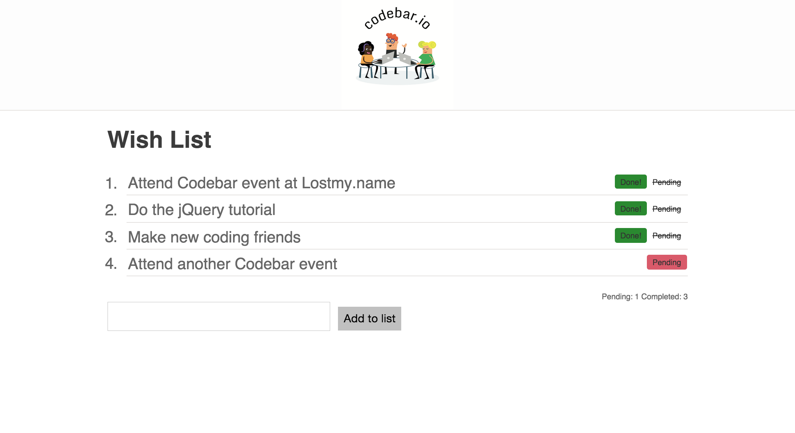

Working through jQuery tutorial at CodeBar, hosted by LostMyName

Coached by @rabeagleissner

http://tutorials.codebar.io/js/lesson3/tutorial.html

* Build a wishlist that takes wishes/tasks as input and creates them as pending. 
* When "pending" is clicked, the status changes to "done". 
* There is a running count of pending and done tasks.

